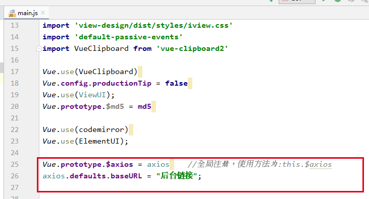
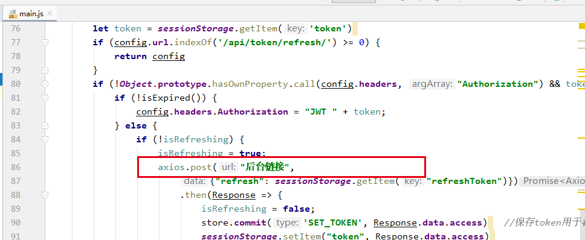
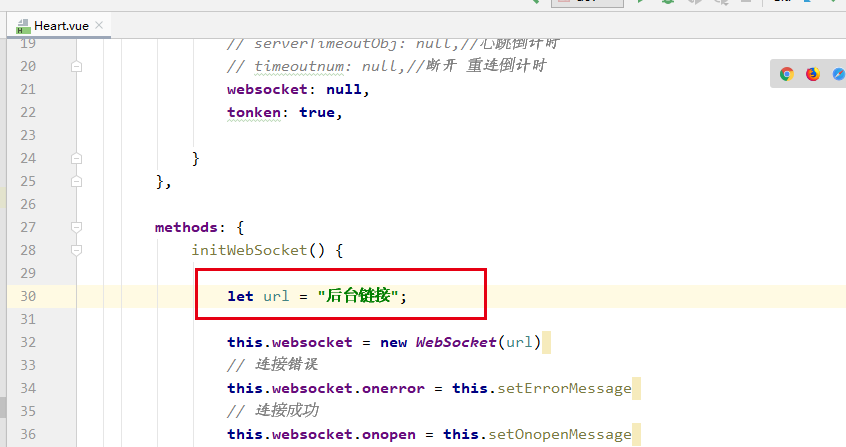

BattleJudge Fronted
===

Project setup
---
~~~
npm install
~~~

Compiles and hot-reloads for development
--
~~~
npm run serve
~~~

Compiles and minifies for production
--
~~~
npm run build
~~~

The interface needs to be configured in the following files
--
main.js\

Utils/Heart.vue\

